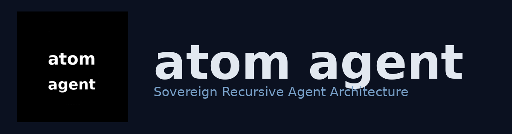
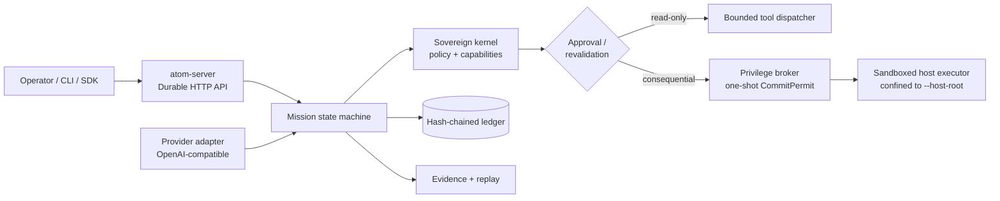

<div align="center">



# ATOM

**A sovereign, provider-agnostic agent runtime written in Rust.**

Capability may recursively grow; authority may not.

[](https://github.com/cryptyroot-ux/atom/actions/workflows/ci.yml)
[](https://github.com/cryptyroot-ux/atom/releases)
[](https://www.rust-lang.org/)
[](LICENSE)

[Install](#install) · [Quick start](#quick-start) · [Architecture](#architecture) · [Security model](#security-model) · [Docs](#documentation)

</div>

ATOM is the control plane for agents that must remain auditable and bounded. A
model may propose a plan, but only the sovereign kernel can authorize an effect;
the append-only ledger records what actually happened. The design is useful when
you want agent capabilities without giving the model ambient authority.

> **Alpha status:** the runtime, durable mission API, provider adapter, recovery
> path, read-only tools, and approval ledger are real and tested. Consequential
> external effects are still proposal-only. ATOM is not yet a drop-in replacement
> for Hermes or OpenClaw, and no 2G superiority claim is made.

## Install

### From a checkout (development)

Requires Rust 1.80+ and the native build dependencies listed in
[`pkg/INSTALL.md`](pkg/INSTALL.md).

```bash
git clone https://github.com/cryptyroot-ux/atom.git
cd atom
cargo install --path cli/atom-cli --locked
atom --version
```

### Universal installer (Linux, macOS, WSL)

For a fresh machine, the installer can be streamed directly from GitHub. It
uses a checksum-verified release asset when one exists and falls back to a
pinned source build. Linux root installs configure systemd and open the
provider onboarding wizard automatically.

```bash
curl -fsSL https://raw.githubusercontent.com/cryptyroot-ux/atom/atom-v4.1-migration-hardening/pkg/scripts/install-universal.sh | bash
```

The wizard asks, in order, whether to use a provider, the OpenAI-compatible
gateway URL, model id, and a hidden API key. It then writes root-only
credentials, restarts the daemon, and prints the verification commands. For
unattended installs, pass the same values explicitly:

```bash
curl -fsSL https://raw.githubusercontent.com/cryptyroot-ux/atom/atom-v4.1-migration-hardening/pkg/scripts/install-universal.sh \
  | bash -s -- \
      --provider-key-file /root/.secrets/provider-api-key \
      --provider-base-url https://free.pango.fun \
      --provider-model auto
```

Use `--no-provider` only when native cognition is intentional, or
`--no-service` when you only want the CLI. To change the provider later, run:

```bash
sudo atom model
```

### As a Linux service (operator deployment)

The installer creates the `atom` service user, state directory, root-owned
credentials, environment file, and systemd unit in one repeatable operation:

```bash
sudo ./pkg/scripts/install.sh --no-provider
atom doctor
atom status
```

To connect an OpenAI-compatible gateway, provide a root-readable key file. The
key is installed through systemd credentials and is never printed:

```bash
sudo ./pkg/scripts/install.sh \
  --provider-key-file /root/.secrets/provider-api-key \
  --provider-base-url https://gateway.example \
  --provider-model auto
sudo systemctl status atom --no-pager
```

See the complete [installation and operations guide](pkg/INSTALL.md).

`install.sh` already runs setup, enables, and restarts the service. Use
`sudo atom setup ...` later only when changing provider or listener settings.

## Quick start

Once the daemon is running, `atom` opens the interactive operator session:

```bash
atom
```

Type a message to chat with the configured model. Use `/mission <goal>` when you
want to create and execute a governed mission, `/status` for daemon health, and
`/model` for the configuration hint, or `/quit` to exit. A plain greeting is never converted into a fake successful
mission. The session is a thin client over the durable API; it does not bypass
authority, validation, or the ledger.

For a direct API smoke test:

```bash
curl -sS http://127.0.0.1:8420/health | jq
curl -sS http://127.0.0.1:8420/ready
curl -sS http://127.0.0.1:8420/capabilities | jq
# conversational smoke test (requires provider onboarding)
curl -sS -X POST http://127.0.0.1:8420/chat \
  -H 'content-type: application/json' \
  -d '{"messages":[{"role":"user","content":"Say hello in one sentence."}]}' | jq
```

To run without systemd from a checkout, set a signing identity and persistent
state path:

```bash
export ATOM_SIGNING_KEY_ID=local-dev
export ATOM_SIGNING_SECRET="$(openssl rand -hex 32)"
mkdir -p state
atom serve --state-db state/atom.sqlite
```

## What works today

Honest state, verified on every push by CI (`cargo fmt`, `build`, `test`,
`clippy -D warnings`, secret scan, and the G0 spec gate).

| Capability | State | Notes |
|---|---:|---|
| Interactive `atom` session | ✅ | Mission submission and terminal status polling |
| Durable HTTP control plane | ✅ | SQLite state, missions, evidence, ledger replay |
| OpenAI-compatible cognition | ✅ | Timeouts, bounded retries, response/plan validation |
| Read-only tools | ✅ | Confined path access with budgets and evidence |
| Approval grants | ✅ | Durable, one-shot redemption in the control plane |
| Crash recovery | ✅ | Sidecar snapshots and kill/restart evidence |
| Governed host mutation (`/host/plan` → `/host/commit`) | ✅ | Plan → owner approval → one-shot permit → sandboxed write, nonce burned durably. **Off unless `--host-root` is passed.** |
| API authentication / multi-tenancy | ❌ | **There is none.** Anything that can reach the port can issue approvals. Bind to loopback only; do not expose. |
| Autonomous LLM → host mutation | ❌ | Deliberate: the cognition loop cannot construct a `HostOp`. Mutation is operator-driven only. |
| Broad tool ecosystem (shell, network, MCP) | 🚧 | Sandbox implements write/remove/spawn; network reconfiguration is refused. Adapters are skeletons. |
| Certified multi-platform release | 🚧 | Source and Linux installer are available; release gate remains open |

### Suitability

ATOM alpha is for **operators evaluating the authority model** on a machine they
control. It is not yet a general-purpose assistant and is not safe to expose on a
network. See [Security model](#security-model) for the exact limits.


## Architecture



The provider is advisory. It can suggest a state-machine-valid plan, but it
cannot grant itself capabilities or write authoritative state. Every accepted
transition is represented by evidence and a ledger event.

## Security model

- **Cognition proposes.** Provider output is untrusted input and is validated
  before it enters the mission state machine.
- **Authority permits.** Typed capability grants, policy checks, and commit-time
  revalidation sit between a proposal and an effect.
- **Reality wins.** The append-only, hash-chained ledger is the source of truth.
- **Taint is non-launderable.** Untrusted data cannot silently become trusted
  evidence or authorization.
- **Unsafe Rust is forbidden.** Workspace crates use `#![forbid(unsafe_code)]`.

### Known limits in alpha (read before deploying)

These are real gaps, not roadmap prose:

1. **No transport authentication.** The HTTP API has no auth layer. Any client
   that can reach the port can `POST /approvals` and approve an effect — the
   approver identity is a self-declared string. Run it bound to `127.0.0.1`
   (the default) and put your own authenticated proxy in front if you must
   expose it. Do not put it on a public interface.
2. **Approvals are unsigned.** An `ApprovalGrant` carries no cryptographic
   signature, so the durable record proves *what* was approved, not *who*
   approved it.
3. **The privilege boundary is in-process.** `atom-privd` is a linked library,
   not a separate privileged daemon. It enforces the permit/nonce/sandbox
   contract, but it shares the server's address space — it is a correctness
   boundary, not yet an OS-level isolation boundary.
4. **No multi-tenancy.** There is one authority domain per daemon. There is no
   per-user isolation.
5. **Host mutation is opt-in and operator-driven.** `/host/*` is disabled unless
   the daemon is started with `--host-root`, and the cognition loop has no path
   to construct a host operation. An LLM cannot mutate the host on its own.


## ATOM alongside Hermes and OpenClaw

Hermes and OpenClaw are excellent operator-facing assistants with broad tool and
channel ecosystems. ATOM currently focuses on a different boundary: making
authority, effects, and evidence explicit and enforceable.

| Concern | Hermes / OpenClaw | ATOM alpha |
|---|---|---|
| Start a conversation | Mature interactive UX | `atom` interactive session |
| Model choice | Multiple providers | OpenAI-compatible gateway + native fallback |
| Tools and channels | Broad, production-oriented ecosystem | Read-only bounded tools; adapters in progress |
| Consequential effects | Product feature, agent-driven | Governed: plan → owner approval → one-shot permit → sandbox. Operator-driven only |
| Auditability | Application-dependent | Ledger, evidence, replay, typed approvals by design |
| Ready for general users | Yes | **No** — alpha, unauthenticated API, narrow tool surface |

If you want an assistant that gets work done today, use Hermes or OpenClaw. Use
ATOM if you want to study or build on an enforceable authority boundary.

The goal is interoperability, not lock-in: versioned adapters for MCP, A2A,
agent-skills, Hermes, and OpenClaw are kept authority-safe.

## Documentation

- [`pkg/INSTALL.md`](pkg/INSTALL.md) — source install, service deployment, provider configuration, Docker, and troubleshooting
- [`spec/`](spec/) — canonical schemas, state machines, requirements, and invariants
- [`docs/`](docs/) — design notes and implementation plans
- [`ORCHESTRATOR.md`](ORCHESTRATOR.md) — runtime orchestration contract
- [`SECURITY.md`](SECURITY.md) — vulnerability disclosure
- [`CONTRIBUTING.md`](CONTRIBUTING.md) — development workflow
- [`GOVERNANCE.md`](GOVERNANCE.md) — project governance and release policy

## Development

```bash
cargo fmt --all -- --check
cargo test --workspace
cargo clippy --workspace --all-targets -- -D warnings
bash tools/secret_scan.sh .
```

ATOM is a 45-package Rust workspace. The evolution and 2G benchmark tracks are
candidate-only research code; benchmark claims remain frozen until the required
competitor pins, budgets, harness, and published failure traces exist.

## License

Licensed under the [Apache License, Version 2.0](LICENSE).
