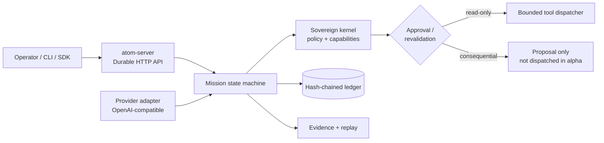

<div align="center">


# ATOM

**A sovereign, provider-agnostic agent runtime written in Rust.**

Capability may recursively grow; authority may not.

[](https://github.com/cryptyroot-ux/atom/actions/workflows/ci.yml)
[](https://github.com/cryptyroot-ux/atom/releases)
[](https://www.rust-lang.org/)
[](LICENSE)

[Install](#install) · [Quick start](#quick-start) · [Architecture](#architecture) · [Security model](#security-model) · [Docs](#documentation)

</div>

ATOM is the control plane for agents that must remain auditable and bounded. A
model may propose a plan, but only the sovereign kernel can authorize an effect;
the append-only ledger records what actually happened. The design is useful when
you want agent capabilities without giving the model ambient authority.

> **Alpha status:** the runtime, durable mission API, provider adapter, recovery
> path, read-only tools, and approval ledger are real and tested. Consequential
> external effects are still proposal-only. ATOM is not yet a drop-in replacement
> for Hermes or OpenClaw, and no 2G superiority claim is made.

## Install

### From a checkout (development)

Requires Rust 1.80+ and the native build dependencies listed in
[`pkg/INSTALL.md`](pkg/INSTALL.md).

```bash
git clone https://github.com/cryptyroot-ux/atom.git
cd atom
cargo install --path cli/atom-cli --locked
atom --version
```

### Universal installer (Linux, macOS, WSL)

For a fresh machine, the installer can be streamed directly from GitHub. It
downloads the pinned source branch and builds locally; no opaque executable is
downloaded. Linux root installs also configure systemd automatically.

```bash
curl -fsSL https://raw.githubusercontent.com/cryptyroot-ux/atom/atom-v4.1-migration-hardening/pkg/scripts/install-universal.sh | bash
```

Use `--no-service` on Linux when you only want the CLI, or set `ATOM_REF` to a
release branch/tag. Published, checksum-verified binary assets will be enabled
once the release gate is closed.

### As a Linux service (operator deployment)

The installer creates the `atom` service user, state directory, root-owned
credentials, environment file, and systemd unit in one repeatable operation:

```bash
sudo ./pkg/scripts/install.sh --no-provider
atom doctor
atom status
```

To connect an OpenAI-compatible gateway, provide a root-readable key file. The
key is installed through systemd credentials and is never printed:

```bash
sudo ./pkg/scripts/install.sh \
  --provider-key-file /root/.secrets/provider-api-key \
  --provider-base-url https://gateway.example \
  --provider-model auto
sudo systemctl status atom --no-pager
```

See the complete [installation and operations guide](pkg/INSTALL.md).

`install.sh` already runs setup, enables, and restarts the service. Use
`sudo atom setup ...` later only when changing provider or listener settings.

## Quick start

Once the daemon is running, `atom` opens the interactive operator session:

```bash
atom
```

Type a mission, inspect the result, then use `/quit` to exit. The session is a
thin client over the durable API; it does not bypass authority, validation, or
the ledger.

For a direct API smoke test:

```bash
curl -sS http://127.0.0.1:8420/health | jq
curl -sS http://127.0.0.1:8420/ready
curl -sS http://127.0.0.1:8420/capabilities | jq
```

To run without systemd from a checkout, set a signing identity and persistent
state path:

```bash
export ATOM_SIGNING_KEY_ID=local-dev
export ATOM_SIGNING_SECRET="$(openssl rand -hex 32)"
mkdir -p state
atom serve --state-db state/atom.sqlite
```

## What works today

| Capability | State | Notes |
|---|---:|---|
| Interactive `atom` session | ✅ | Mission submission and terminal status polling |
| Durable HTTP control plane | ✅ | SQLite state, missions, evidence, ledger replay |
| OpenAI-compatible cognition | ✅ | Timeouts, bounded retries, response/plan validation |
| Read-only tools | ✅ | Confined path access with budgets and evidence |
| Approval grants | ✅ | Durable, one-shot redemption in the control plane |
| Crash recovery | ✅ | Sidecar snapshots and kill/restart evidence |
| Consequential external effects | 🚧 | Kernel contracts exist; dispatcher is not enabled |
| Certified multi-platform release | 🚧 | Source and Linux installer are available; release gate remains open |

## Architecture



The provider is advisory. It can suggest a state-machine-valid plan, but it
cannot grant itself capabilities or write authoritative state. Every accepted
transition is represented by evidence and a ledger event.

## Security model

- **Cognition proposes.** Provider output is untrusted input and is validated
  before it enters the mission state machine.
- **Authority permits.** Typed capability grants, policy checks, and commit-time
  revalidation sit between a proposal and an effect.
- **Reality wins.** The append-only, hash-chained ledger is the source of truth.
- **Taint is non-launderable.** Untrusted data cannot silently become trusted
  evidence or authorization.
- **Unsafe Rust is forbidden.** Workspace crates use `#![forbid(unsafe_code)]`.

## ATOM alongside Hermes and OpenClaw

Hermes and OpenClaw are excellent operator-facing assistants with broad tool and
channel ecosystems. ATOM currently focuses on a different boundary: making
authority, effects, and evidence explicit and enforceable.

| Concern | Hermes / OpenClaw | ATOM alpha |
|---|---|---|
| Start a conversation | Mature interactive UX | `atom` interactive session |
| Model choice | Multiple providers | OpenAI-compatible gateway + native fallback |
| Tools and channels | Broad, production-oriented ecosystem | Read-only bounded tools; adapters in progress |
| Consequential effects | Product feature | Proposal-only until dispatcher/release gates close |
| Auditability | Application-dependent | Ledger, evidence, replay, typed approvals by design |

The goal is interoperability, not lock-in: versioned adapters for MCP, A2A,
agent-skills, Hermes, and OpenClaw are kept authority-safe.

## Documentation

- [`pkg/INSTALL.md`](pkg/INSTALL.md) — source install, service deployment, provider configuration, Docker, and troubleshooting
- [`spec/`](spec/) — canonical schemas, state machines, requirements, and invariants
- [`docs/`](docs/) — design notes and implementation plans
- [`ORCHESTRATOR.md`](ORCHESTRATOR.md) — runtime orchestration contract
- [`SECURITY.md`](SECURITY.md) — vulnerability disclosure
- [`CONTRIBUTING.md`](CONTRIBUTING.md) — development workflow
- [`GOVERNANCE.md`](GOVERNANCE.md) — project governance and release policy

## Development

```bash
cargo fmt --all -- --check
cargo test --workspace
cargo clippy --workspace --all-targets -- -D warnings
bash tools/secret_scan.sh .
```

ATOM is a 45-package Rust workspace. The evolution and 2G benchmark tracks are
candidate-only research code; benchmark claims remain frozen until the required
competitor pins, budgets, harness, and published failure traces exist.

## License

Licensed under the [Apache License, Version 2.0](LICENSE).
