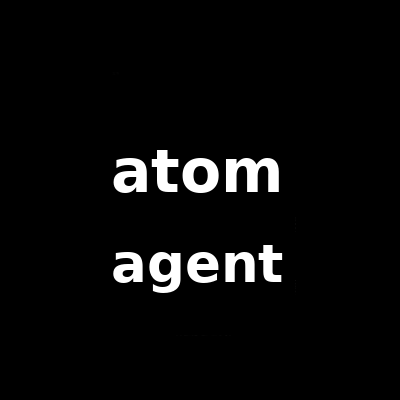

# ⚛ ATOM

**Sovereign Recursive Agent Architecture** — a provider-agnostic Sovereign Agentic Operating System written in Rust.

> Capability may recursively grow; authority may not.
> Cognition proposes. Sovereign authority permits. Reality determines outcome.

[](crates/)
[](https://github.com/cryptyroot-ux/atom/actions/workflows/ci.yml)
[](LICENSE)
[-orange)](https://github.com/cryptyroot-ux/atom/releases)
[](https://www.rust-lang.org/)
[](https://github.com/cryptyroot-ux/atom/actions/workflows/ci.yml)
[](CODE_OF_CONDUCT.md)



---

## Why ATOM exists

Most agent frameworks let *any* component mutate state, call tools, and escalate
privilege. That is fine until an agent is wrong — and agents are wrong often.

ATOM draws a hard constitutional line:

- **Cognition proposes.** The probabilistic brain explores, plans, and suggests.
  It can *never* touch authoritative state.
- **Sovereign authority permits.** A single, unbypassable kernel gates every
  consequential mutation behind typed capabilities + effect revalidation.
- **Reality determines outcome.** An append-only, hash-chained ledger is the
  source of truth — not memory, not the model, not the last caller.

The result: an agent that can **grow its own capabilities recursively** without
ever growing its own authority. That is the "sovereign" in the name.

## What it gives you

- **43 composable Rust crates** — 32 core/plane crates (a sovereign kernel,
  capability grants, an effect reducer, a tamper-evident ledger, epistemic memory,
  taint tracking, deterministic replay, a fault classifier, supply-chain artifact
  sealing, and more), a 4-module evolution lab (experience compiler, cognition JIT,
  architecture learner, evaluator), 5 versioned adapters, plus CLI and SDK.
- **Verified experience as a primitive** — claims, taint, and replay turn runtime
  observations into compounding, auditable evidence instead of vibes.
- **Provider-agnostic** — plug any model/runtime through versioned adapters
  (MCP, A2A, agent-skills, Hermes, OpenClaw). Adapters *cannot* widen authority.
- **Content-addressed artifacts** — `atom-artifact` seals builds with SHA-256
  identity, provenance, SBOM, and signature; tampering is detectable.

## Status (honest)

| Gate | State |
|---|---|
| G0 Spec Freeze | ✅ done |
| G1 Sovereign Core | ✅ done |
| G2 Useful Operator | 🔧 partial |
| G3 Epistemics | ✅ done |
| G4 Foundry | ✅ done (CLI + SDK + packaging merged) |
| G5–G7 Compounding / Learning / Evolution | ✅ built & merged — capability foundry, experience compiler, architecture safety, architecture learner, cognition JIT, evaluator, evolution ring, and a reproducible 2G benchmark harness. Candidate-only (Lab-stage), **not yet a trained learner**; the 2G superiority claim stays **FROZEN** (INV-020). |

This is an **alpha**. The constitutional core is real and tested (482 passing
tests across 43 crates, `cargo clippy` clean). The G5–G7 evolution/learning tracks
are merged as candidate-only code — no trained learner is deployed, and no 2G
superiority claim is made (INV-020 frozen: no claim without pinned competitor
versions, comparable budgets, a reproducible harness, and published failure
traces). CLI, SDK, and packaging (Docker, systemd) are merged. Operator
ergonomics (PWA, API server) are not yet built.

## Quick start

**Prerequisites:** Rust edition 2021 toolchain, rustc 1.80+ (`rustup`).

```sh
# install the `atom` CLI from this repo
cargo install --path cli/atom-cli
# or build from a checkout:
cargo build --release -p atom-cli

# run the test suite (482 tests)
cargo test --workspace
```

**Try the sovereign binary:**

```sh
# signing identity (required for artifact seal/verify — keep the secret out of source)
export ATOM_SIGNING_KEY_ID="my-key"
export ATOM_SIGNING_SECRET="$(openssl rand -hex 32)"   # demo only; use a real secret

# seal bytes into a content-addressed, signed artifact (SUP-001)
echo "hello sovereignty" | atom seal --input /dev/stdin --out artifact.json
cat artifact.json

# verify it — exits non-zero if the artifact was tampered with
atom verify artifact.json

# boot the runtime and drive one real mutation
atom run
```

See [`spec/`](spec/) for the authoritative machine-readable contracts
(schemas, state-machines, enums, requirements, invariants).

## How ATOM differs

Most agent frameworks treat the model as trusted: it plans, it calls tools, it
mutates state. ATOM does not. The difference is architectural, not cosmetic:

| Property | Typical agent framework | ATOM |
|---|---|---|
| Who can mutate state | The model, directly | A single unbypassable kernel |
| Mutation authority | Implicit / ambient | Typed capability grants + commit-time revalidation |
| Memory of what happened | Chat log / DB writes | Append-only hash-chained ledger (tamper-evident) |
| Untrusted input | Flows through | Non-launderable taint labels govern disclosure |
| Unsafe code | Varies | `#![forbid(unsafe_code)]` in every crate |
| Evidence | Vibes | Claims + provenance + deterministic replay |

The result is an agent that can **recursively grow its own capabilities** without
ever growing its own authority — and leaves an auditable trail of every mutation.

## Layout

```
spec/          canonical contracts (authoritative)
crates/        32 Rust crates — sovereign core + planes, capability foundry, evolution ring, benchmark harness + runtime, conformance, architecture safety
evolution/     Evolution Lab (candidate-only): experience-compiler, cognition-jit, architecture-learner, evaluator
adapters/      mcp, a2a, agent-skills, hermes, openclaw (versioned, authority-safe)
cli/atom-cli   `atom` CLI
sdk/atom-sdk   typed clients for the /v1 API
```

## License

Licensed under the [Apache License, Version 2.0](LICENSE).

## Governance & Conduct

- [GOVERNANCE.md](GOVERNANCE.md) — roles, decision process, release policy
- [CODE_OF_CONDUCT.md](CODE_OF_CONDUCT.md) — Contributor Covenant v2.1
- [SECURITY.md](SECURITY.md) — vulnerability disclosure process
